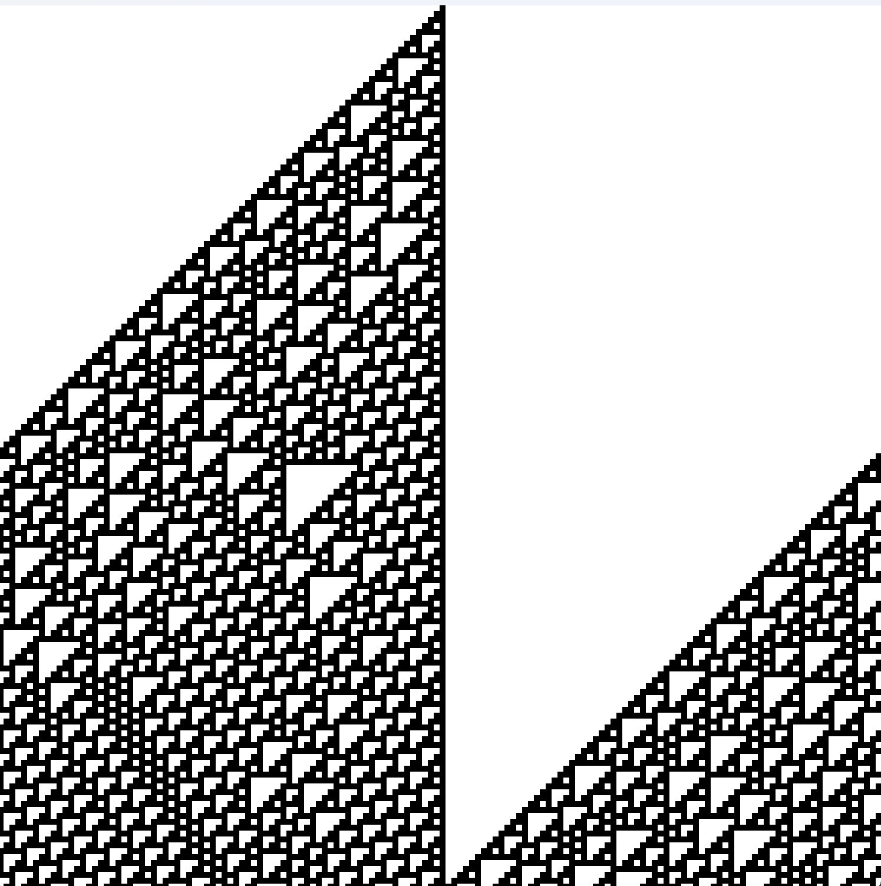

# Elementary cellular automata
This is a visual representation of Wolfram's CA rules.

<h2> Theory </h2>

  Elementary cellular automata (ECAs) are a class of simple mathematical models used to study complex systems and patterns. They consist of a grid of cells, where each cell can be in one of two states (typically 0 or 1). The state of a cell in the next time step depends on its current state and the states of its two neighboring cells, according to a set of rules. There are 256 possible rule sets in ECAs, and despite their simplicity, these automata can generate a wide variety of complex and interesting patterns, making them a valuable tool in the study of self-organization and emergent behavior.

<h2> How to use </h2>

  In order to change the current CA, just change the RULESET_ID variable to a value between 0 and 256.

 

